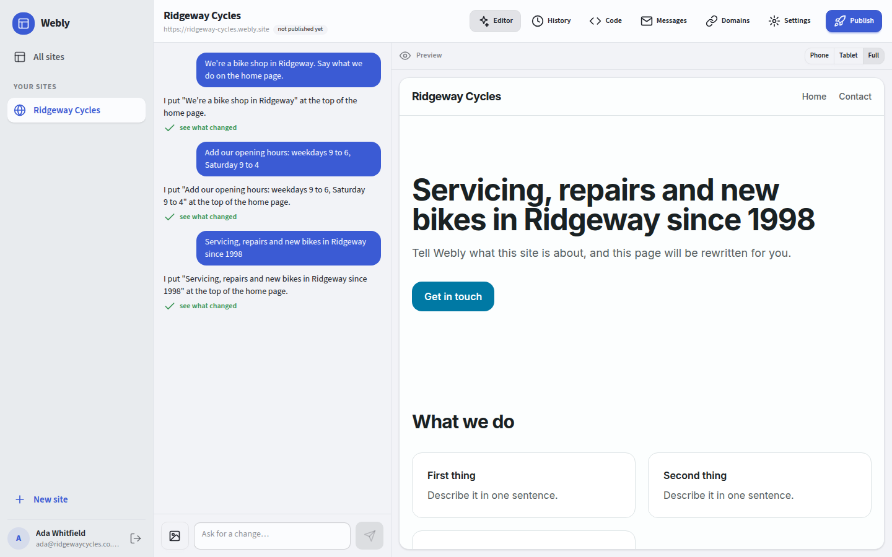

# Webly

**Describe your website in a chat and get one** — versioned, on your own domain, published to the internet,
without touching a line of code.



A site here is **a real Next.js project in its own git repository**, edited by a coding agent running in a
sandbox. Webly's own code never writes a page. It owns the repository, the versions, the sandbox, the preview
proxy and the publish; the agent writes the `.tsx` files and Next.js renders them.

That is the decision everything else follows from, and it costs something: there is no structured document to
validate, so "did the change work" is answered by a compiler and a browser rather than by a schema.
`docs/domain-plan.md` §1 is the argument, including what the model it replaced was better at.

## What it does today

- **A chat that edits a website.** Each turn runs a coding agent — Claude Code or OpenCode, behind one
  interface — in a sandbox holding the site's files, and commits what comes back as one version.
- **A preview that updates itself.** The site's own `next dev`, proxied through Webly's origin, so hot reload
  puts the agent's edits on screen with nothing asking for them.
- **A history you can undo.** Every version is a commit with the message that caused it; restoring writes the
  old tree forward as a new commit, so undoing an undo is the same operation again.
- **Publishing.** A real `next build` in a fresh sandbox, then a static export on a provider. A site that does
  not compile is never published, and the reason is a log the editor shows.
- **Domains**, mirrored from the provider, which owns verification and the certificate.
- **Forms and photographs.** A published site is a static export with no server, so its contact form posts to
  Webly, which stores the message and emails the owner with the visitor's address as the reply-to. Images are
  committed into the site's repository, so the published site serves them from its own domain.
- **Your code, actually yours.** A Code tab that shows the source, and a Download that hands over a git
  bundle — `git clone site.bundle` is a working project with every version and every commit message.

## Running it

You need **node, git and a Postgres**. Not Docker, not a model key, not a hosting account: each of those has a
development substitute that refuses to run in production.

```bash
dotnet dev-certs https --trust                                   # once
dotnet run --project Webly.Api --launch-profile https            # https://localhost:5000
yarn --cwd client start                                          # proxied through the backend
```

**Backend first**: the client's `prestart` generates its API client from the backend's live swagger. There is
a `./run-app.ps1 start|stop|status` that does both in the right order, and an MCP server under `tools/dev-mcp`
that the agent working in this repository uses for the same thing.

Open `https://localhost:5000`, register, and make a site. The defaults give you:

| Piece | Default | What you get |
|---|---|---|
| `Sandbox:Provider` | `local` | the sandbox agent as a child process, with a workspace on disk |
| `Agent:Mock:Enabled` | `true` | a mock agent that makes one real, deterministic edit |
| `Deployment:Provider` | `filesystem` | a real `next build`, exported to `.run/published/{id}` and served |

Each is one configuration key away from the real thing: `Agent:ClaudeCode:ApiKey`, `Sandbox:Provider=docker`,
`Deployment:Provider=vercel`.

### Driving it without a browser

```bash
node tools/e2e/run.mjs --agent mock      # the whole loop, underneath the C#: git, sandbox, next dev, build
node tools/e2e/turn.mjs --site <id> …    # one turn through the running backend, over the real hub
node tools/e2e/screens.mjs --email …     # every screen in a real browser, at two widths
```

The third one exists because the defects that cost this project the most were all pages that answered 200
with perfect HTML and were wrong to look at.

## How it is put together

```
Webly.Api       controllers, the hub, middleware, the reverse proxy
Webly.Services  all business logic — use cases, the agent, sandboxes, repositories, deployments
Webly.Data      EF Core, entities, migrations
client/         Angular 22, SSR, zoneless, signals
templates/      the Next.js project a new site starts as
tools/          the sandbox agent, the dev MCP server, the harnesses
```

Everything the browser talks to is one origin: the backend serves `/api`, `/health` and the hub, and
reverse-proxies the rest to the Angular app. There is no CORS and there must not be.

## Where the reasoning lives

- **`CLAUDE.md`** — the working guide: every decision that would otherwise be re-derived wrongly, and the
  facts about running the stack that cost time if unknown. Read this first.
- **`MASTER_PLAN.md`** — the plan of record. **`whats_next.md`** — where work actually stopped, and the list
  of defects found by running the thing rather than reading it.
- **`docs/domain-plan.md`** (sites, source, versions), **`docs/agent-plan.md`** (the agent, the sandbox, the
  run substrate), **`docs/deploy-plan.md`** (publishing, domains, Vercel).
- **`PROJECT.md`** — what Webly is and which two projects its architecture comes from.

## Status

The whole loop has been driven through the running app: a verified account, a site whose repository holds the
template in one commit, agent turns each committing a version, the preview served through Webly's own origin,
and a published page on the internet.

What has **not** run, and should be read as a plan rather than as working code: the Vercel deployment target,
the Docker and E2B sandbox providers, the OpenCode agent, and the real model-backed agent inside the app
(`tools/e2e/run.mjs` has driven the real `claude` CLI, but every turn through the app so far has been the
mock). Google sign-in and Resend are configuration away and absent by design without it.
